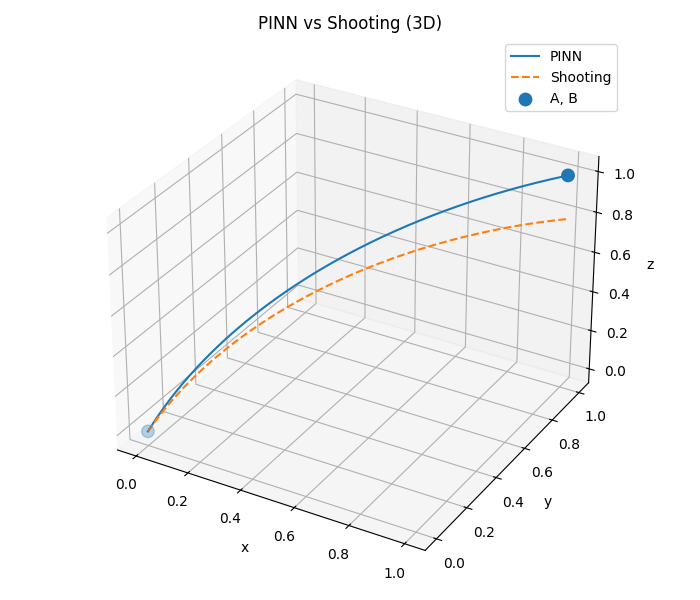
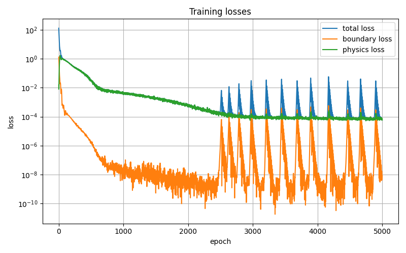
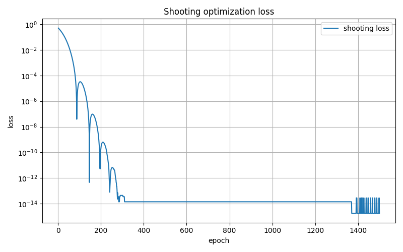

# PINN Trajectory Optimization in a Magnetic Field

This project investigates **Physics-Informed Neural Networks (PINNs)** for computing the trajectory of a charged particle moving in a magnetic field between two fixed spatial points.

The project combines neural network-based methods with classical mechanics and numerical solvers.

The goal is to study how PINNs can be used to learn physically consistent trajectories, compare them with classical numerical methods, and investigate their behavior in more complex physical settings.

---

# Example Result

The trajectories produced by the PINN and the shooting method are visually almost identical.



PINN training loss:



Shooting optimization loss:



Numerical values depend on the specific experiment configuration and random seed.

---

# Problem Description

We consider the motion of a charged particle in a constant magnetic field

$$
\mathbf{B} = (0, 0, B_z)
$$

The trajectory is parameterized as

$$
(x(t), y(t), z(t))
$$

The equations of motion follow the Lorentz force

$$
m \ddot{\mathbf{r}} = q (\mathbf{v} \times \mathbf{B})
$$

The task is to find a trajectory such that

$$
\mathbf{r}(0) = A, \quad \mathbf{r}(T) = B
$$

with unknown initial velocity.

---

# Methods

Two main approaches are implemented.

## Physics-Informed Neural Network (PINN)

The neural network predicts the trajectory

$$
t \rightarrow (x(t), y(t), z(t))
$$

Automatic differentiation is used to compute velocities and accelerations.

Two formulations are supported.

### Newtonian formulation

The loss includes:

- boundary constraints  
- physics residual based on the Lorentz force equations  

---

### Variational formulation (Euler–Lagrange)

Instead of using forces directly, the system is formulated via the Lagrangian

$$
L = \frac{m}{2}(v_x^2 + v_y^2 + v_z^2)
+ \frac{q B_z}{2}(x v_y - y v_x)
$$

The dynamics are enforced using the Euler–Lagrange equations:

$$
\frac{d}{dt}\left(\frac{\partial L}{\partial v_i}\right)
- \frac{\partial L}{\partial x_i} = 0
$$

This provides a **variational formulation** of the same physical system.

---

## Shooting Method

The shooting method solves the same boundary value problem by optimizing the initial velocity.

Steps:

1. Guess initial velocity  
2. Integrate the equations of motion  
3. Minimize final position error  

---

# Key Insight

For a constant magnetic field:

- Newtonian PINN and variational PINN produce equivalent trajectories  
- shooting method achieves higher numerical precision  
- PINN learns a **global representation of the trajectory**  

---

# Installation

```bash
pip install torch matplotlib numpy